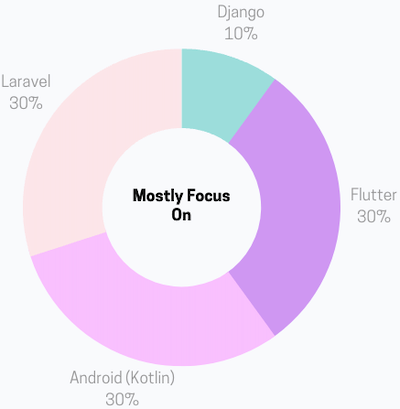

### Full-Stack Developer | Android, Flutter, Laravel

Hi, I'm Maxwell from Johor, Malaysia. I'm a full-stack developer with a focus on Android native apps, Flutter hybrid apps, and Laravel backend development. I also have experience deploying applications to Linux servers.

I'm currently learning Kubernetes, Jetpack Compose, and Kotlin Clean Architecture to improve my skills. I'm passionate about solving problems and creating efficient solutions. Let's connect and explore how I can bring value to your team.

- 🌍 I'm based in Johor, Malaysia
- ✉️ You can reach me on [LinkedIn](https://www.linkedin.com/in/maxwell-ang-siang-heng-330265ab/)
- ⚡ Fun fact: Djing 🎶, Anime 🥰️

#### Currently Learning 📚📖📝

- 💪 Kubernetes
- 💪 Kotlin Jetpack Compose
- 💪 Kotlin Clean Architecture

### Programming languages

### Frontend

### Backend

### Database management tools

### Cloud platforms

### Others

### Tools 🛠️

  

